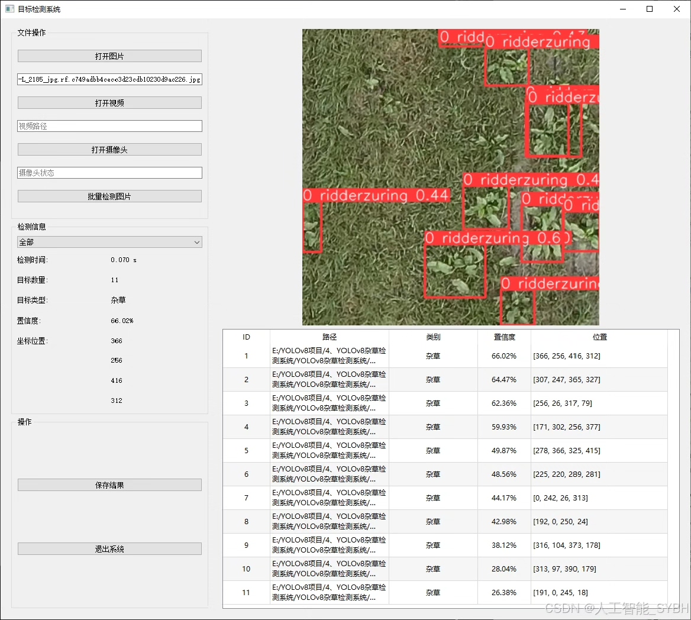
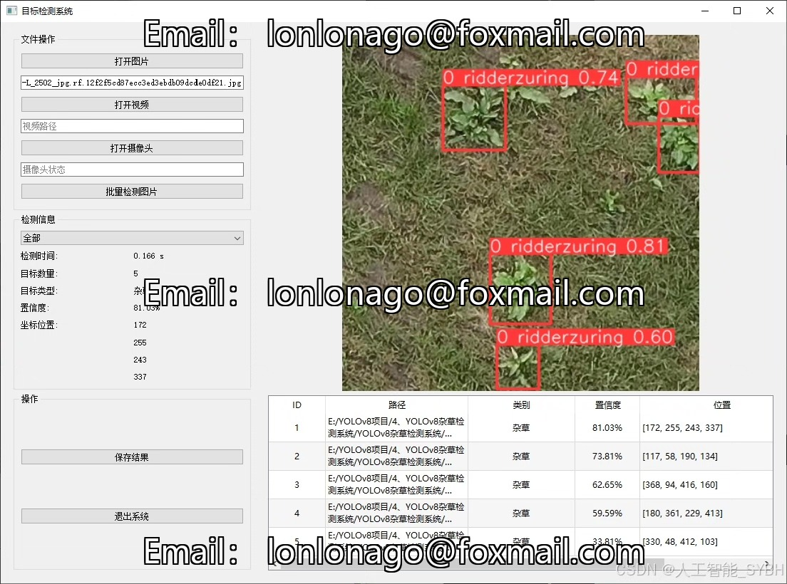
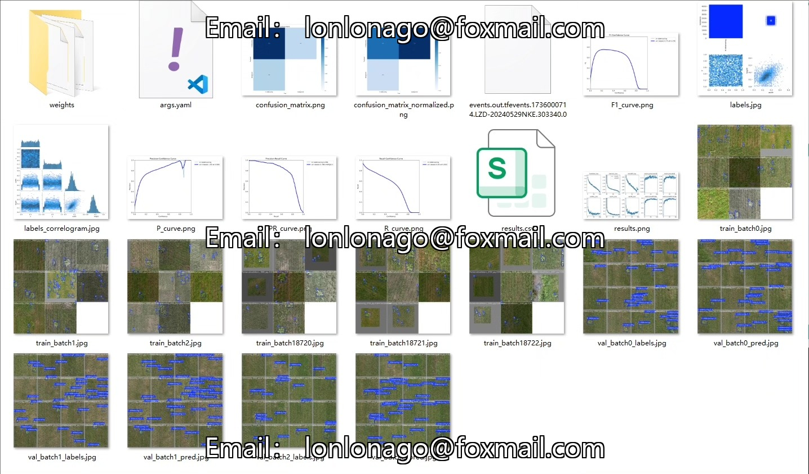
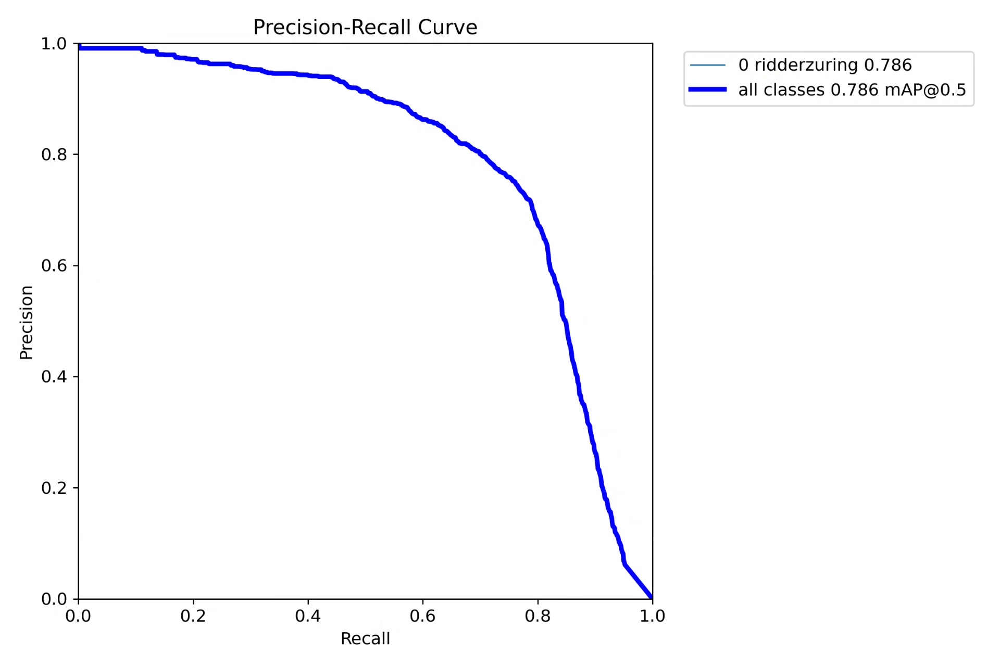
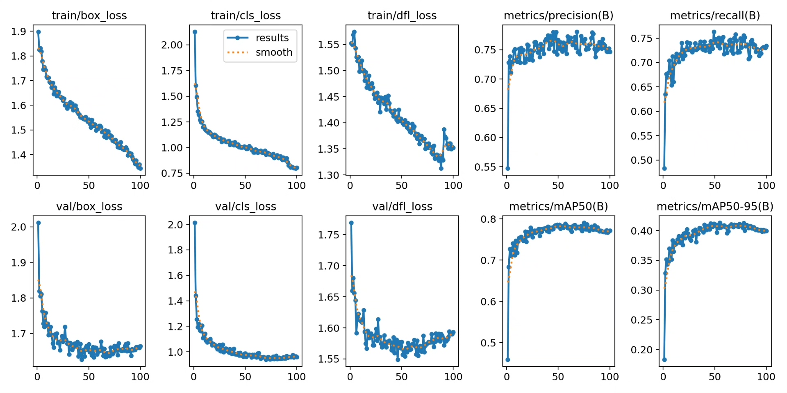
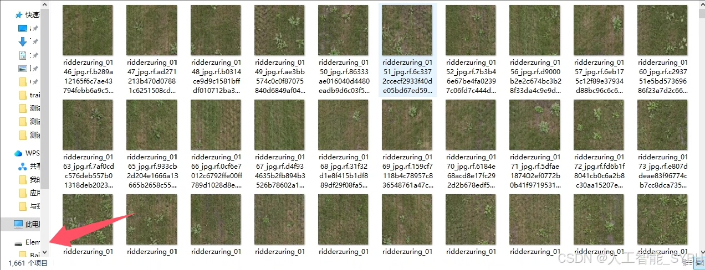
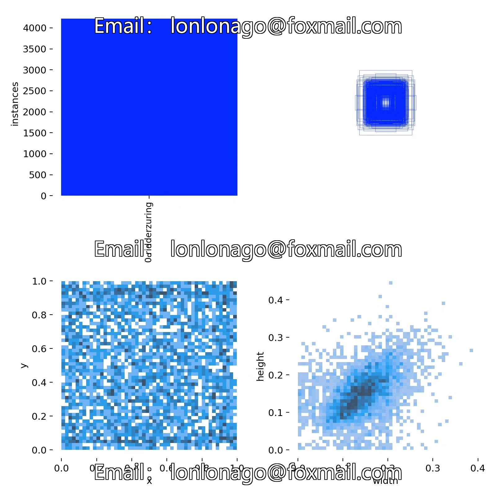
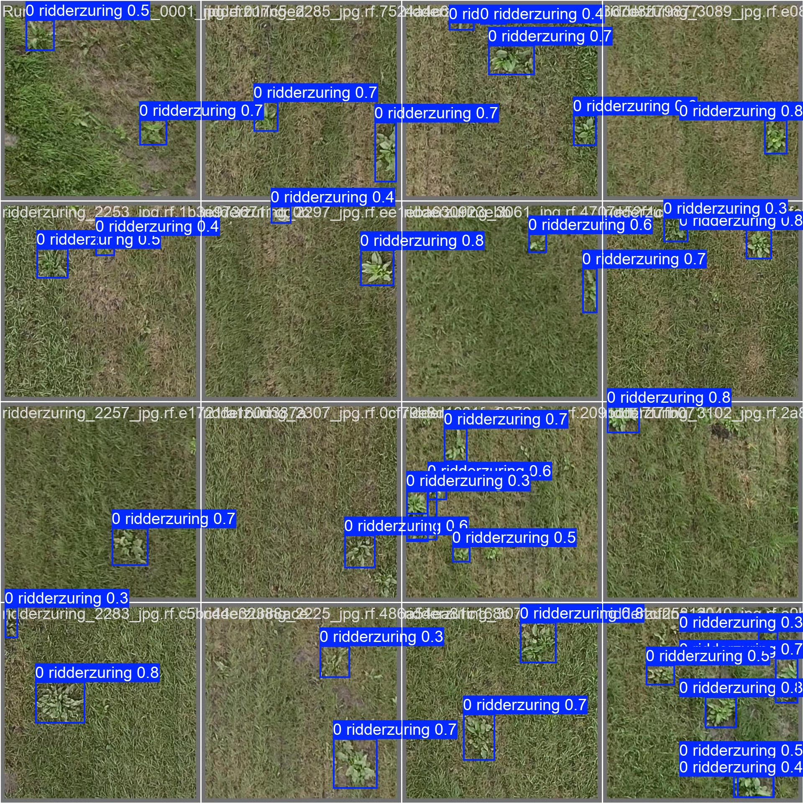

# Weed detection system based on YOLOv8 deep learning (YOLOv8+YOL)

## Body

Based on the advanced YOLOv8 object detection algorithm, this project has developed a high-efficiency detection system specifically for identifying specific weed species ('0 ridderzuring'). The system uses a specialized dataset containing 1,661 training images, 580 validation images, and 245 test images for training and optimization, achieving high accuracy in target weed identification. The system can be deployed on agricultural machinery, drones, or mobile devices, providing an intelligent solution for weed management in precision agriculture.

The company's products have obtained YOLO official commercial license certification.

We offer after-sales service.

After payment, we will provide WeChat IDs to answer questions anytime.

Environmental configuration: We will provide a tutorial on environmental configuration, and WeChat will provide answers.

Remote installation services: If you need remote configuration of the environment, an additional fee of 69 is required. If the configuration fails, all fees will be refunded (specially for older computers only refunding installation fees).

Retraining the dataset: After configuring the environment, you can train on your own computer. If you need us to retrain, just pay 69 plus computing power fees (2.5 yuan/hour).

Full after-sales service

## Images

## Payment

Here is a pay link on Stripe ( https://buy.stripe.com/3cs8yP7sY87d0vu9AB ). Please contact me lonlonago@foxmail.com after funding $89, and I will send you a complete data files , thank you!

